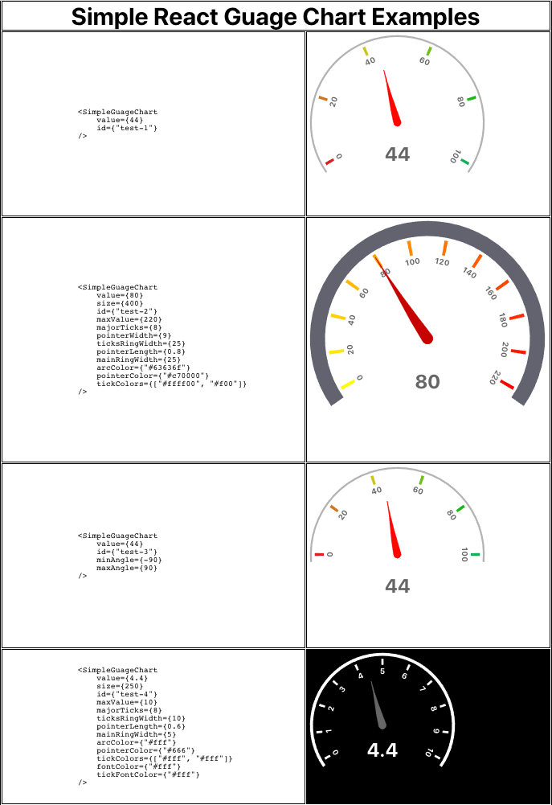

# simple-react-d3-guage-chart

> simple guage chart for react made using d3

[](https://www.npmjs.com/package/simple-react-d3-guage-chart) [](https://standardjs.com)

## Install

```bash
npm install --save simple-react-d3-guage-chart
```

## Usage

```jsx
import React, { Component } from 'react'

import SimpleGuageChart from 'simple-react-d3-guage-chart'
import 'simple-react-d3-guage-chart/dist/index.css'

class Example extends Component {
  render() {
    return <SimpleGuageChart id={"guage-01"} value={40}/>
  }
}
```

## Examples


## Properties

| Name            | PropType                    | Description                                                    | Default value          |
|-----------------|-----------------------------|----------------------------------------------------------------|------------------------|
| value           | PropTypes.string.isRequired | Used to Display the value below the pointer                    |                        |
| id              | PropTypes.string.isRequired | Unique ID for graph                                            |                        |
| size            | PropTypes.number            | Size of The chart, Min Value is 200px                          | 300                    |
| minValue        | PropTypes.number            | Minimum value on the scale                                     | 0                      |
| maxValue        | PropTypes.number            | Maximum value on the scale                                     | 100                    |
| minAngle        | PropTypes.number            | Minimum angle at which the pointer starts. You need to provide both min and max angle. Min angle should always be less than max angle.| -120 |
| maxAngle        | PropTypes.number            | Maximum angle at which the pointer ends                        | 120                    |
| majorTicks      | PropTypes.number            | Number of Expected Ticks, This will not be same as ticks appearing in graph, This varies based on d3 scale for min and max value. | 7 |
| pointerWidth    | PropTypes.number            | Width of pointer. Diameter at the starting of pointer. Should be in between 2 to 10| 6  |
| pointerLength   | PropTypes.number            | Pointer length Percentage, Should be in between 0.3 and 1      | 0.7                    |
| mainRingWidth   | PropTypes.number            | Thickness of ring.should be minimum 1                          | 3                      |
| ticksRingWidth  | PropTypes.number            | Height of Ticks. Should be in between 0 and 30                 | 15                     |
| tickColors      | PropTypes.array             | Color of ticks. Should be an array of length 2.                | ["#d92121", "#12af5a"] |
| pointerColor    | PropTypes.string            | Color of Pointer                                               | "#ff0500"              |
| arcColor        | PropTypes.string            | Color of Main Arc                                              | "#b3b3b3"              |

## License

MIT © [bhanupradeep7](https://github.com/bhanupradeep7)
